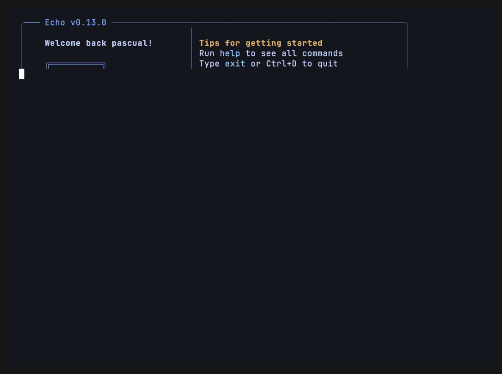
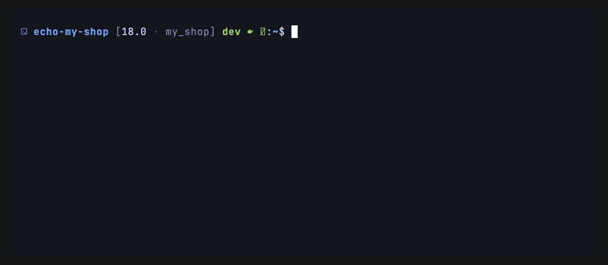
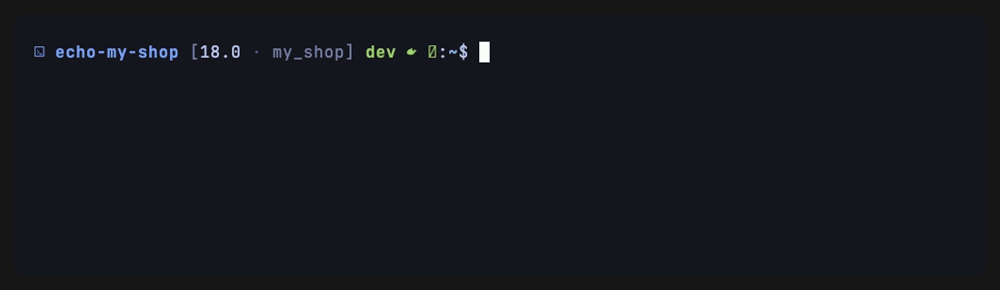
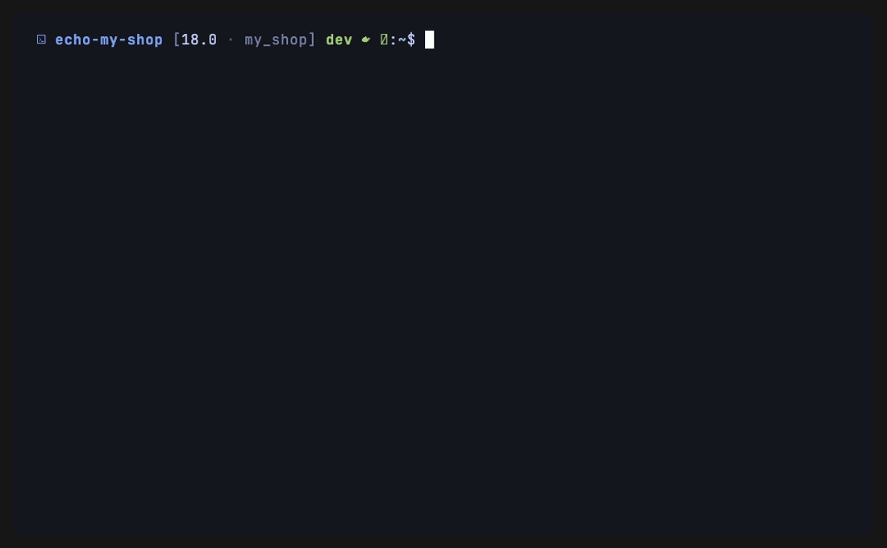
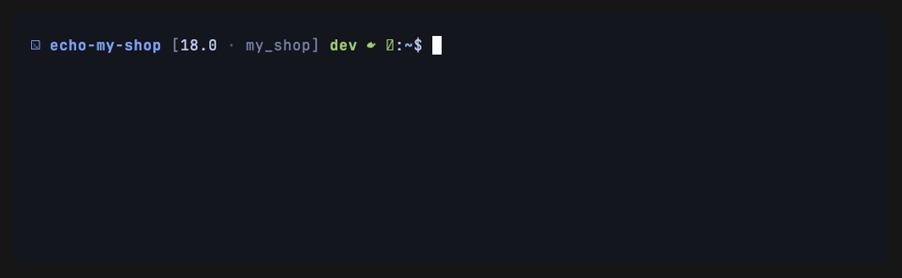
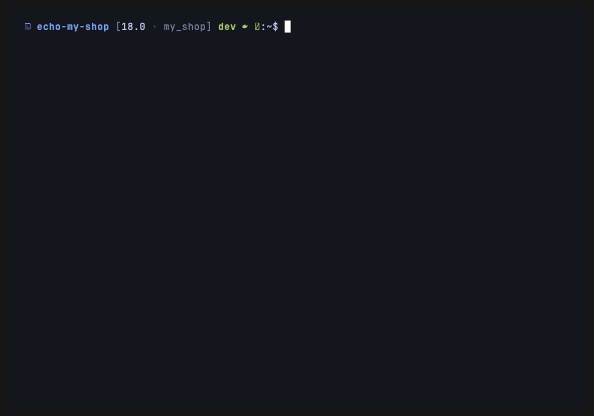

# Echo

> Interactive CLI for Odoo development environments — Docker, modules, databases, translations, and login sessions through one short prompt.

Echo is a single-binary REPL for Odoo projects. Drop into a project directory,
run `echo`, and you get a styled prompt that wraps `docker compose`,
`pg_dump`/`pg_restore`, and the `odoo` CLI behind short memorable commands.
Output streams in real time, colored by log level, and every long-running
command ends with a clear ✓/✗ result line. The same commands also run
non-interactively (`echo <cmd>`) and as multi-step recipes (`echo run`).

<p align="center">
  
</p>

> Demos are recorded with [VHS](https://github.com/charmbracelet/vhs); the data
> shown is illustrative (see [`demo/`](demo/)).

## Status

Echo is a work in progress; below is what currently ships in `main`.

| Area      | Working                                                                 | Pending                         |
|-----------|-------------------------------------------------------------------------|---------------------------------|
| Project   | `init`, `reset`, `alias` (`-C <name>` registry), `help`, `clear`        | `version`, `stage`, `theme`, `logo` |
| Docker    | `up`, `down`, `stop`, `restart`, `ps`, `logs` (`--copy`/`--all`/`-t`)    | —                               |
| Modules   | `install`, `update` (`--i18n`), `uninstall`, `test`, `modules` (`--config`), `modinfo`, `view` | —             |
| Database  | `db-admin`, `db-backup` (`--with-filestore`), `db-restore` (rename + live progress), `db-drop`, `db-neutralize`, `db-list`, `db-use` | — |
| Shell     | `shell`, `bash`, `psql`                                                  | —                               |
| i18n      | `i18n-export`, `i18n-update`, `i18n-pull` (from a remote)                | —                               |
| Connect   | `connect` — open Chrome logged in as any user, no password              | —                               |
| Deploy    | `link` — bind a local repo to a remote target; `deploy` — commit- and dirty-module-driven remote update/install over SSH | — |
| Build     | `<cmd> --build` / `-b` — compose any command interactively, then run/copy | —                             |
| Scripting | `echo <cmd>` one-shot, `echo run <file>` recipes, `report`              | —                               |
| REPL UX   | ↑↓ history, fzf picker, level-colored logs, ✓/✗ result, Tab + flag autocomplete, live command/flag highlighting | Full ASCII banners |
| Themes    | charm, hacker, odoo, tokyo                                              | —                               |

The full build plan lives in [`context/specs/00-build-plan.md`](context/specs/00-build-plan.md);
per-unit specs sit alongside it.

## Install

Requires Go 1.25+.

```sh
go install github.com/pascualchavez/echo@latest
```

The binary is installed as `echo` in `$GOBIN`. Make sure that directory is on
your `PATH`.

To build from source instead:

```sh
git clone https://github.com/pascualchavez/echo.git
cd echo
go build -o echo .
```

## Quick start

From the root of an Odoo project (one with a `docker-compose.yml`):

```sh
echo
```

On first run, Echo can't find a project config and asks you to run `init`:

```
  echo my-shop-a1b2 [dev/18.0]:~$ init
```

`init` is an interactive form (Charm `huh`) that auto-detects:

- The compose flavor (`docker compose` vs `docker-compose`)
- Running containers (lists Odoo + db candidates via `compose ps`)
- Databases inside the db container (via `psql -lqt`)
- POSTGRES credentials from `.env`

It walks you through picking the Odoo version, Odoo and DB containers, DB name,
stage (`dev`/`staging`/`prod`), and an optional alias to reach the project with
`-C <name>` from anywhere. The result is saved to
`~/.config/echo/projects/<sha256-of-path>.toml`. Echo never writes anything
into your project repo.

Once `init` is done the prompt updates to reflect the chosen stage and version,
and every command is wired to the right containers.

## Command reference

### Project

| Command  | Description                                                        |
|----------|--------------------------------------------------------------------|
| `init`   | Interactive setup (Odoo version, containers, DB, stage, optional alias) |
| `reset`  | Wipe Echo config — global, per-project, or both                    |
| `alias [<name>]` | Register this project so `-C <name>` stands in for its path (no args: list) |
| `  --list` | List all project aliases                                         |
| `  --rm <name>` | Remove an alias                                            |
| `  --migrate` | Backfill aliases from connect targets with local paths       |
| `link [<target>]` | Bind this directory to a connect target (no args: picker)  |
| `  --show` | Show the binding, probe the remote, stream its `compose ps`     |
| `  --rm`   | Remove this directory's `[connect]` binding                     |
| `help`   | Print the in-REPL command list, grouped by area                    |
| `clear`  | Clear screen and reprint the header                                |
| `exit` / `quit` / `Ctrl+D` | Quit Echo                                        |

Aliases live in `~/.config/echo/global.toml` (`[project_aliases]`) as a
`name → local-path` registry. `echo -C <name> <cmd>` resolves the name to its
path; a real directory of the same name always wins, so `-C <dir>` behavior is
unchanged. `-C` also falls back to a connect target's `remote_path` when it
points at a local directory.

### Docker

| Command            | Description                                          |
|--------------------|------------------------------------------------------|
| `up [service]`     | `docker compose up -d`                               |
| `down [service]`   | `docker compose down` (red confirm on `prod` unless `--force`) |
| `stop [service]`   | `docker compose stop`                                |
| `restart [service]`| `docker compose restart`                             |
| `ps`               | Show compose container status                        |
| `logs [service]`   | Follow Odoo logs (or `[service]`); `Ctrl+C` exits    |
| `  -t N`           | Tail the last `N` lines (default `100`)              |
| `  --no-follow`    | Disable follow mode, bounded output                  |
| `  -c, --copy`     | Bounded output **and** copy to system clipboard      |
| `  --all`          | All compose services instead of just Odoo            |

Compose lifecycle lines (`Container … Started`) are reformatted into Echo's
Odoo log style (`docker.container: started name=…`).

### Modules

| Command                  | Description                                          |
|--------------------------|------------------------------------------------------|
| `install <mod>...`       | Install modules in the active DB                     |
| `  --with-demo`          | Include demo data                                    |
| `update <mod>...`        | Update modules                                       |
| `  --all`                | Update every installed module                        |
| `  --last`               | Repeat the last update for this project + DB         |
| `  --i18n`               | Overwrite the modules' translations from their shipped `.po` (all langs) |
| `  --installed`          | Source the picker from every installed module (e.g. `base`), not just the repo |
| `uninstall <mod>...`     | Uninstall modules                                    |
| `  --level <lvl>`        | Odoo `--log-level` (`debug`…`critical`) — on install/update/uninstall |
| `test <mod>...`          | Run the modules' Odoo test suite (filters `--test-tags`) |
| `  --update`             | Reload modules first (`-u`; for view/schema changes) |
| `  --tags <spec>`        | Override the auto test-tags filter                   |
| `modules`                | List modules from the configured addons paths        |
| `  --config`             | Interactive form to pick which folders are addons paths |
| `modinfo [<mod>]`        | Compare the DB-installed version against the manifest version |
| `  --copy`               | Copy the report to the clipboard                     |
| `  --last`               | Re-show this session's last `modinfo` (skips the picker) |
| `view [<mod>]`           | Pick a module file and view it (`bat` if available, else plain) |
| `  --copy`               | Copy the file to the clipboard instead               |
| `  --last`               | Re-display this session's last viewed file (skips pickers) |

When `install`/`update`/`uninstall`/`test` are called without module names,
Echo opens an fzf-style fuzzy picker scoped to the project's modules — host
folders, or the instance's `odoo.conf` `addons_path` when the host scan is
empty. The `update` picker highlights the previous run's modules; confirming
it with nothing selected offers to repeat that last update. The start line
names the resolved modules (picker / `--last` / `--all`) so you always know
what's running.

`update sale --i18n` resolves the module, streams Odoo's own loading log, and
overwrites the shipped translations along the way:

<p align="center"></p>

By default that picker is scoped to the project's addons. `update --installed`
sources it from **every module installed in the database** (`ir_module_module`)
instead — so you can pick a core module like `base` (or any third-party addon)
without typing its name. Explicit names still work too (`update base`); the flag
only changes what the picker offers:

<p align="center"></p>

`modinfo` compares the version Odoo recorded as installed against the manifest —
`up to date` stays INFO, a pending upgrade is flagged WARN:

<p align="center"></p>

### Database

| Command                          | Description                                                       |
|----------------------------------|-------------------------------------------------------------------|
| `db-admin [name]`                | Reset the admin user (uid 2) login **and** password to `admin`/`admin`; red confirm only on `prod` (`--force` skips) |
| `db-backup [name]`               | `pg_dump -Fc` into `./backups/<db>_<ts>.dump`                     |
| `  --with-filestore`             | Package dump + container filestore into a `.zip` (Odoo-compatible) |
| `db-restore [--as N] [--force] [--neutralize]` | Pick a backup (Echo `.dump` or native Odoo `.zip`), name the target DB, create it, and restore the filestore — narrating each step live |
| `  --as <name>`                  | Set the target name up front (skips the rename prompt)            |
| `db-drop [name] [--force]`       | Drop a database; red confirm unless `--force` (terminates active connections) |
| `db-neutralize [name] [--force]` | Run Odoo's native `neutralize`; red confirm only on the active DB or `prod` |
| `db-list`                        | Table of DBs with size and creation date; `●` marks the active one |
| `db-use [name]`                  | Switch the active database (picker when no name); persists to the project config so the prompt and every command follow it |

On the first successful backup, Echo appends `backups/` to your `.gitignore`
when one exists at the project root.

`db-restore` is interactive end to end: pick a backup, then **rename the
target** in a prompt pre-filled with the name derived from the file (handy
when an odoo.sh dump carries a long name that would bloat every log line —
just shorten it, or press Enter to keep it; `--as <name>` skips the prompt).
The restore then **narrates each phase live** — creating the database,
streaming `pg_restore`, copying the filestore — instead of sitting silent:

<p align="center"></p>

`db-use` switches which database is active (the one `db-list` marks `●` and
the implicit target of `update`/`shell`/`psql`/`db-admin`/…); `db-admin`
resets the admin user to `admin`/`admin` to get back into the back office
when you don't have the password.

<p align="center"></p>

### Shell

| Command | Description                                              |
|---------|----------------------------------------------------------|
| `shell` | Odoo shell (`odoo shell`) inside the container           |
| `  --from <target>` | Open the shell on a **remote** instance (named connect target) |
| `  --remote` | Open the shell on this directory's linked remote (see `link`) |
| `shell-run [<file>]` | Run a local `.py` through the Odoo shell (stdin); no file → picker |
| `  --no-copy` | Don't auto-copy the script's output to the clipboard |
| `  --from <target>` / `--remote` | Run the script on a remote instance |
| `bash`  | An interactive `bash` in the Odoo container              |
| `psql`  | `psql` into the active database                          |

The remote shell rides the same SSH transport as `deploy`: the interactive
session opens over `ssh -tt` with the usual startup-log coloring, and
`shell-run --from prod fix_taxes.py` pipes your local script into the remote
container's Odoo shell — handy for applying one-off data fixes without
copying files to the server. Prod confirmation uses the remote profile's
stage.

`shell` also accepts **piped stdin** — with a non-TTY stdin it runs the piped
content through the Odoo shell headless instead of opening the interactive
session, local or remote:

```sh
cat fix_taxes.py | echo shell                    # local
cat fix_taxes.py | echo shell --from prod --force # remote (prod needs --force headless)
echo 'env["res.users"].search_count([])' | echo -C my-shop shell
./generate_fix.sh | echo shell-run -              # `-` = read the script from stdin
```

### i18n

| Command                       | Description                                              |
|-------------------------------|----------------------------------------------------------|
| `i18n-export <mod> [lang]`    | Export `<mod>/i18n/<lang>.po` (default `es_MX`)          |
| `  --out <path>`              | Write to `<path>` instead of the module's `i18n/`        |
| `i18n-update <mod> [lang]`    | Import the module's `<lang>.po` into the DB (`--i18n-overwrite`) |
| `  --force`                   | Skip the prod-stage confirmation                         |
| `i18n-pull [<mod>] [lang]`    | Pull a module's `<lang>.po` **from a remote** Odoo instance into the local repo |
| `  --from <target>`           | Use a named connect target (default: the project's `[connect]`) |
| `  --all`                     | Pull every candidate module                              |
| `  --installed`               | List candidates from the DB (all installed), not just the project's addons |

`i18n-pull` reaches the remote over SSH like `connect` — it runs `--i18n-export`
inside the remote container and writes the `.po` into your working tree
(`<addons>/<mod>/i18n/<lang>.po`), for bringing translations edited in a remote
prod/staging UI back to the repo. The remote DB is never modified. Like
`connect`, it doesn't require a local compose project: run it from a pure addons
repo with `--from <target>`.

### Connect

`connect [<login>] [--all] [--force] [--fresh] [--new-window]` opens Chrome
already logged in as any Odoo user — no password, no open ports, nothing
installed in Odoo. Echo mints a web session inside the container (locally or
over SSH) and lands the cookie in a dedicated Chrome via CDP. Sessions are
cached and reused (`--fresh` re-mints); `--new-window` opens an isolated
incognito window so several users can be open at once. The projectless form
`echo connect <name>` connects to a saved remote target from anywhere.

### Deploy

`deploy` pushes selected local commits to a remote Odoo instance over SSH:
pick commits, Echo maps each one to its module, decides install vs update by
asking the remote database, recreates the containers, and runs one combined
`-i`/`-u` Odoo pass — all streamed live with the usual log coloring. It
assumes the code is **already pulled on the server**; `deploy` only handles
the container and module state.

The picker also offers your **uncommitted (dirty) modules** — addons with
working-tree changes — as selectable entries above the commits
(`~ <module> · uncommitted (N files)`). Pick them to fold those modules into
the same `-i`/`-u` run; the final module set is the union of commit-resolved
and dirty modules. Since dirty code isn't committed (let alone pushed), a
`WARNING` reminds you that `deploy` updates them on the server but doesn't put
the code there — that's for the tool you use to sync the working tree.

<p align="center"></p>

| Command            | Description                                              |
|--------------------|----------------------------------------------------------|
| `deploy`           | Multi-select picker over recent commits **and** dirty modules, then remote `stop` → `up -d` → `odoo -i/-u` |
| `  --from <target>`| Use a named connect target (default: this directory's `link`) |
| `  --limit <N>`    | Commits offered in the picker (default `20`)             |
| `  --dry-run`      | Resolve modules and show the plan; execute nothing       |
| `  --force`        | Skip the prod-stage confirmation                         |

Commit → module resolution follows the project's commit scheme
`[Tag] module_name: title` (valid only when the module exists in the repo);
when the subject doesn't match, Echo inspects the commit's changed files and
uses the module if exactly one addon was touched. Commits that resolve to no
module are skipped with a warning and reported in the final summary — they
never abort the run. A selected dirty module resolves straight to its name
(`via=dirty`).

#### Example: link a repo and deploy (dummy data)

One-time setup. On the **server**, create the Echo profile `deploy` reads
(containers, DB, stage):

```sh
ssh erp-prod                      # host alias from your ~/.ssh/config (key auth)
cd /srv/odoo/my-shop && echo init
```

On your **laptop**, register the remote as a connect target and bind your
addons repo to it:

```sh
echo connect prod                 # one-time: registers ssh_host + remote_path as target "prod"
cd ~/dev/my-shop-addons           # your local addons repo (no docker-compose.yml needed)
echo link prod                    # writes this directory's [connect] binding
echo link --show                  # verify: probes the profile + streams the remote `compose ps`
```

Then, each deploy (after the server has pulled the new code):

```sh
echo deploy --dry-run             # pick commits, see the plan, touch nothing
echo deploy                       # the real thing (red confirm if the remote stage is prod)
```

```
  ❯ echo deploy
  … INFO my-shop echo.deploy.remote: target resolved host=erp-prod path=/srv/odoo/my-shop
  [multi picker: dirty modules + commits]
    ❯ ☑ ~ stock_extra  ·  uncommitted (3 files)
      ☑ a1b2c3d  [FIX] sale_extra: correct tax rounding
      ☑ e4f5a6b  [ADD] website_promo: launch banner
      ☐ 0c1d2e3  [IMP] docs: update install notes
  … INFO my-shop echo.deploy: items selected commits=2 dirty=1
  … INFO my-shop echo.deploy: resolved module=stock_extra via=dirty
  … WARNING my-shop echo.deploy: selected modules have uncommitted changes — deploy updates them on the server but does not push the code modules=stock_extra
  … INFO my-shop echo.deploy: resolved commit=a1b2c3d module=sale_extra via=subject
  … INFO my-shop echo.deploy: resolved commit=e4f5a6b module=website_promo via=diff
  … INFO my-shop echo.deploy: plan update=sale_extra,stock_extra install=website_promo skipped=1
  … INFO my-shop echo.deploy.compose: stop
  … INFO my-shop echo.deploy.compose: up -d
  … INFO my-shop echo.deploy.odoo: running module install/update
  2026-06-12 … INFO my-shop odoo.modules.loading: Modules loaded.
  … INFO my-shop echo.deploy: deploy complete update=2 install=1 skipped=1
  ✓ deploy completed
```

`sale_extra` is already installed on the remote, so it lands in `-u`;
`website_promo` isn't, so it gets `-i` — that split comes from the remote's
`ir_module_module`, not from the commit tags. `stock_extra` was picked from
the working tree (`via=dirty`) and joins the update set.

### Output & reporting

| Command                 | Description                                                  |
|-------------------------|--------------------------------------------------------------|
| `copy-last [--errors]`  | Copy the last command's output (or only its error/warn lines) |
| `report [--step=N] [--level=lvl \| --min-level=lvl] [--copy]` | Inspect or copy the last `echo run`'s logs by step and level |

`report` reads the structured record every `echo run` persists, so it works
across invocations. `--level=warn` matches that level exactly;
`--min-level=error` matches it and more severe (`ERROR`/`CRITICAL` stay
distinct). Without `--copy` the matched lines print, colored by level.

## Build mode

Any command accepts a universal `--build` / `-b` flag that composes it
interactively instead of running it directly:

```
  echo my-shop [dev/18.0]:~$ update --build
  [multi picker: modules]      → sale, account
  [multi picker: flags]        → --level, --i18n
  [picker: value for --level]  → debug
  Composed: update sale account --level=debug --i18n
  [select] Run it now / Copy to clipboard / Cancel
```

It walks you through the command's positional picker(s) — modules, database,
backup file, or compose service — then a multi-select of its known flags,
prompting for a value on each flag that takes one (a picker when the options are
known, free text otherwise). Finally it shows the composed line and asks what to
do: **Run** it now (through the normal command frame), **Copy** the recipe-style
line to the clipboard (no `echo ` prefix, ready to paste into a `.echo` file), or
**Cancel**.

`--build` / `-b` highlight and Tab-complete on every command. Build mode is
interactive, so a non-TTY invocation (recipe, CI) fails closed with exit 2.
`i18n-pull --build` is remote-aware: it resolves a connect target first, bakes
`--from=<target>` into the line, and lists that remote's own modules for the
picker.

## Scripting & recipes

Every command also runs **non-interactively**, so Echo fits into scripts and CI:

```sh
echo update sale --level=warn      # run one command and exit with a status code
echo -C ~/projects/shop ps         # run from outside the project directory
echo -C my-shop ps                 # …or by a registered alias (see `alias`)
```

Exit codes: `0` success, `1` execution error (or `ERROR`/`CRITICAL` lines),
`2` usage / a prompt that can't run without a TTY, `3` cancelled.

`echo run <file>` runs a **recipe** — one command per line — as an update
routine:

```sh
echo run deploy.echo
```

```
# deploy.echo — annotated, blank lines and # comments ignored
stop
db-backup --with-filestore
up
update sale account --silent=info   # hide INFO noise, keep warnings/errors
restart
```

- `--pick` — choose a `*.echo` recipe from the current directory via a picker.
- `--continue-on-error` — run every step instead of stopping at the first failure.
- `--log[=<path>]` — save a plain transcript: bare `--log` → a timestamped file
  under `~/.config/echo/run-logs/`; `--log=<file>` → an explicit path;
  `--log=.` (or any directory) → `<recipe>.log` there.
- `<step> --silent[=<lvl>]` — silence a single step's output (screen **and**
  `--log`). Bare `--silent` hides everything; `--silent=info` hides that level
  and below while still showing more severe lines. The step's recap stays
  visible and the lines remain queryable via `report`.

The run ends with a per-step summary (status, warnings, duration) and a totals
line, all in Echo's Odoo log style and captured by `--log`.

## Output features

- **Level-colored streams.** Odoo log lines (`DEBUG`/`INFO`/`WARNING`/`ERROR`/`CRITICAL`) are recolored using the active theme; Python tracebacks inherit the color of the line that triggered them.
- **DB-name truncation.** A long database name (e.g. an odoo.sh dump) in the log lines' `db` column is middle-truncated on screen past `log_db_max` chars (default 20) — `mycompany-…_23-42-53` — so it doesn't wrap the rest of the line. Display-only: `copy-last` and `echo run --log` keep the full name.
- **Foreign-line normalization.** `docker compose` progress and loose-severity tool stderr (e.g. wkhtmltopdf's `Warn: Can't find .pfb …`) are reformatted into the same Odoo log style instead of leaking as raw text. The `shell` command also recolors Odoo's own startup logs (which arrive raw over the PTY) and dims the Python/IPython banner.
- **Migration detection.** `install` / `update` / `uninstall` passively watch the stream for Odoo migrations and close with one `echo.<cmd>.migration` line per migrated module (`module=… version=… phases=…`); `report` reconstructs the same summary from the last run.
- **Action result line.** Every long-running command finishes with `✓ <name> completed` or `✗ <name> failed: …`. Silent failures — exit 0 with `ERROR`/`CRITICAL` log lines — render as `✗ <name> finished with N error(s)`. A failure auto-copies the relevant log slice to the clipboard.
- **Fuzzy picker.** Filter is always active; type to narrow, `Tab` to toggle, `Enter` to confirm, scrollable for long lists. Single-select variants are used for restore, drop, connect, and recipe selection.
- **Live editing.** The first token is highlighted green/red as you type (valid command or not); known flags get an accent color and Tab-complete.
- **History.** ↑/↓ navigation across sessions, persisted to `~/.config/echo/history` (cap 1000 entries, consecutive duplicates collapsed).

## Themes

Four palettes ship in the binary: `charm`, `hacker`, `odoo`, `tokyo`. The
theme is stored in `~/.config/echo/global.toml` so it's shared across all
projects. Stage modifies the prompt accent: `dev` (green), `staging`
(yellow), `prod` (red).

## Configuration

```
~/.config/echo/
├── global.toml          # theme, logo, compose flavor, prompt, log_db_max, connect targets, project aliases
├── history              # REPL command history
├── run-logs/            # `echo run --log` transcripts + last-run.json (for `report`)
├── connect-sessions/    # cached `connect` web sessions, per target
├── last-updates/        # `update --last` recall, per project + DB
└── projects/
    └── <sha256>.toml    # one file per project path
```

Per-project files are keyed by the SHA-256 of the project root so two projects
with the same folder name never collide. `reset` lets you wipe global,
per-project, or both. Echo writes only under `~/.config/echo/` — never into
your project repo (except appending `backups/` to an existing `.gitignore`).

## Project layout

```
.
├── main.go                  # entry point (one-shot dispatch, REPL, `run`)
├── internal/
│   ├── banner/              # header + ASCII logo rendering
│   ├── clipboard/           # cross-platform clipboard (OSC 52-aware)
│   ├── cmd/                 # command implementations (init, docker, modules, db, i18n, connect, picker, …)
│   ├── config/              # ~/.config/echo/ layout + caches
│   ├── docker/              # compose + psql + pg_dump/restore wrappers
│   ├── env/                 # .env parser
│   ├── odoo/                # odoo CLI invocation builders
│   ├── project/             # walk-up to find project root
│   ├── repl/                # prompt, dispatch, line styling, recipes, report
│   └── theme/               # palettes + styles
└── context/                 # six-file methodology docs + per-unit specs
```

## Development workflow

This project is built using the
[Six-File Context Methodology](context/) (spec-driven dev). Each feature gets
a spec in [`context/specs/`](context/specs/) before it's implemented; the
build plan in [`context/specs/00-build-plan.md`](context/specs/00-build-plan.md)
tracks the ordered units. The methodology docs are also useful as a tour of
the project for new contributors.

Commits follow a fixed format generated by
[`commitcraft`](https://github.com/pascualchavez/commitcraft):

```
[TAG] scope: short title

Body explaining the change.
```

Common tags: `ADD`, `FIX`, `IMP`, `REF`, `DOC`, `REM`, `REL`.

## Roadmap

Pending units, in plan order:

- **Unit 14** — meta commands (`theme`, `logo`, `version`, `stage`).
- **Unit 15** — all four ASCII logos with per-segment token coloring.

## License

TBD.
